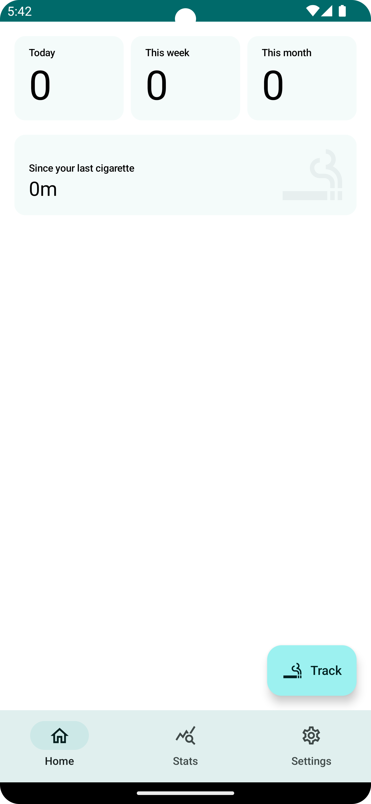
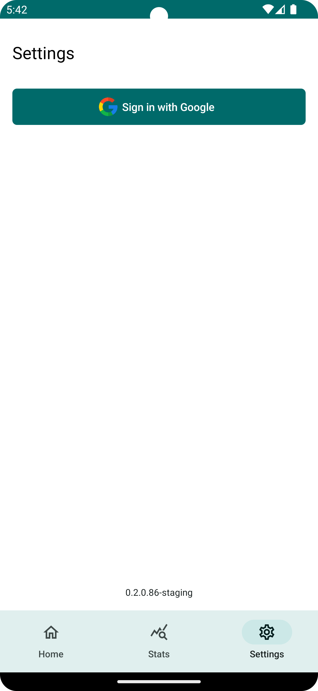

# Smoke Analytics

[](https://github.com/feragusper/SmokeAnalytics/actions/workflows/deployment_artifact.yml)

[](https://github.com/feragusper/SmokeAnalytics/actions/workflows/deployment_playstore.yml)

[](https://github.com/feragusper/SmokeAnalytics/actions/workflows/integration.yml)

[](https://sonarcloud.io/dashboard?id=<OWNER>_<REPO_NAME>)
[](https://sonarcloud.io/component_measures/metric/coverage/list?id=<OWNER>_<REPO_NAME>)
[](https://sonarcloud.io/component_measures/metric/reliability_rating/list?id=<OWNER>_<REPO_NAME>)
[](https://sonarcloud.io/component_measures/metric/code_smells/list?id=<OWNER>_<REPO_NAME>)
[](https://sonarcloud.io/component_measures/metric/security_rating/list?id=<OWNER>_<REPO_NAME>)

Android application to track smoking habits and run analytics on them.

📸 Screenshots
--------------
<p>
  <!--suppress CheckImageSize -->

  <!--suppress CheckImageSize -->

</p>

💻Requirements and Getting started
----------------------------------
Java 17 is required.

> :warning: **This project won't compile unless a few credentials are provided**

In order to build it locally:

- Add `google.auth.server.client.id=\"GOOGLE_AUTH_SERVER_CLIENT_ID\"` to local.properties (used by
  firebase google auth).
- Add proper `google-services.json` (download it from firebase project) to app module (used by
  firebase firestore and google auth).

- Use `./gradlew assemble` to build it, or run it in Android Studio.
- Use `./gradlew test` to run the unit test on your local host.

🏗️Architecture
--------------
Based on Clean Architecture. Using MVI, Use Cases and Repositories.
Modules are split by feature. App module is almost empty, it's just the glue between the modules.

Features can be found in the `features` module. Each feature has its own module, and it's split in 3
layers:

- `domain`: Contains the business logic of the feature. It's the core of the feature, and it's
  agnostic of the platform.
- `data`: Contains the implementation of the repositories defined in the domain layer. It's the
  layer that knows how to get the data from the platform.
- `presentation`: Contains the UI of the feature. It's the layer that knows how to display the data
  to the user.

Shared libraries can be found in the `libraries` module. Following the same structure as the
features, each library has its own module, and it's split in 3 layers if necessary.

📚Libraries included
--------------------

- Kotlin
- Architecture Components
- Kotlin Coroutines/Flow
- Hilt
- Retrofit and OkHttp
- Compose
- Navigation Component
- JUnit
- Mockk
- Firebase
- Google Auth

⚙️CI
----
Github Actions are used for automating several recurrent processes:

- Integration: Run unit tests. It's triggered on every PR.
- Deployment Artifact: Build and deploy a new artifact to Github Packages. It's triggered on every
  push to master.
    - There should always be available a latest debug build for downloading
      at https://github.com/feragusper/SmokeAnalytics/actions/workflows/deployment.yml
- Deployment Playstore: Build and deploy candidate releases to Playstore in closed beta channel. Can
  be executed manually with proper credentials.

🤝Support & Contribute
----------------------
If you've found an error in this project, please file an
issue: https://github.com/feragusper/SmokeAnalytics/issues

Patches are encouraged, and may be submitted by forking this project and submitting a pull request
through GitHub.

Pull requests are welcome.

1. Fork it!
2. Create your feature branch: `git checkout -b my-new-feature`
3. Commit your changes: `git commit -am 'Add some feature'`
4. Push to the branch: `git push origin my-new-feature`
5. Submit a pull request :D

## License

```
Copyright 2025 feragusper

Licensed under the Apache License, Version 2.0 (the "License");
you may not use this file except in compliance with the License.
You may obtain a copy of the License at

    https://www.apache.org/licenses/LICENSE-2.0

Unless required by applicable law or agreed to in writing, software
distributed under the License is distributed on an "AS IS" BASIS,
WITHOUT WARRANTIES OR CONDITIONS OF ANY KIND, either express or implied.
See the License for the specific language governing permissions and
limitations under the License.
```

## Third-Party Libraries

This project includes code from the AAY-Chart library, originally developed
by [The Chance](https://github.com/TheChance101/AAY-chart) under the MIT License. Modifications have
been made to better integrate with Smoke Analytics.